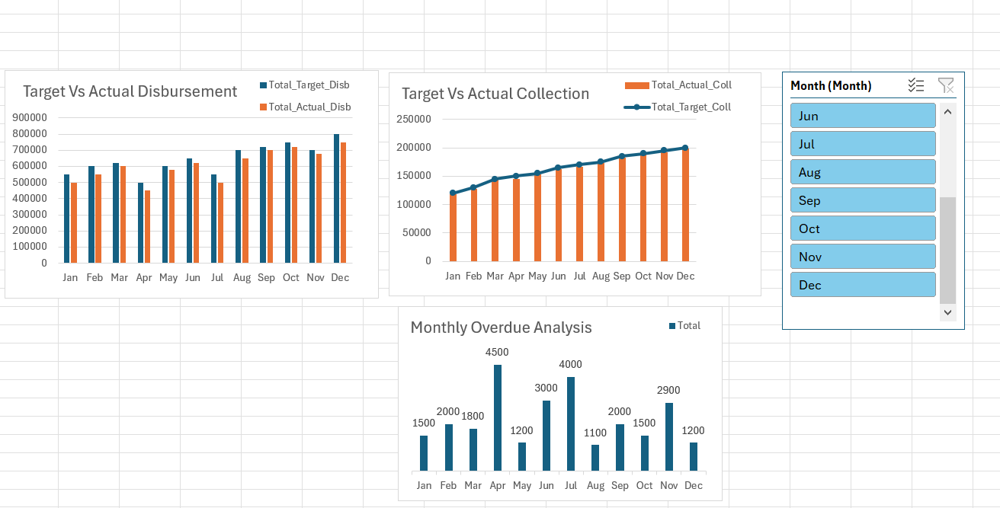

# Interactive Loan & Disbursement Analytics Dashboard

A dynamic corporate-level Excel data analytics dashboard built to monitor loan distributions, collection efficiency, and financial risk profiles. 

## 📊 Dashboard Preview

## 🛠️ Tech Stack & Features Used
- *Power Query:* Data extraction, transformation, cleaning, and data modeling.
- *Power Pivot & Data Model:* To handle structural relational data tables smoothly.
- *Advanced DAX Measures:* Used robust calculations instead of basic Excel formulas to prevent operational errors.
- *Dynamic Slicers:* Connected reports uniformly for real-time month-over-month metric changes.

## 📈 Key Performance Indicators (KPIs) Analysed
1. *Disbursement Performance:* Monthly target vs actual loan payout mapping.
2. *Collection Performance:* Target vs actual collection tracking.
3. *Monthly Overdue Analysis:* Risk monitoring to evaluate late payments and default trends.
4. *Key Rates Computed:* 
   - *Recovery Rate:* 98.65% (Overall efficiency of structural collections)
   - *PAR Rate (Portfolio at Risk):* 0.37% (Advanced risk mitigation tracker)
